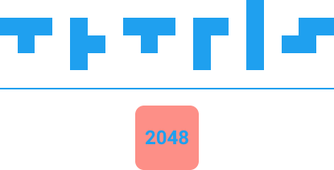

# 🎮 T2048 Nexus

[](https://github.com/alirkal34-jpg/Tetris2048-Game/actions/workflows/ci.yml)
[](./LICENSE)
[](https://www.python.org/)

> **TR:** Tetris ve 2048 mekaniklerini birleştiren hızlı tempolu bir puzzle oyunu.  
> **EN:** A fast-paced puzzle game that blends classic Tetris with 2048 tile merging.

---

## 🎮 Game Overview | Oyun Özeti

**TR:** T2048 Nexus, tetromino parçalarını klasik Tetris düzeninde düşürürken aynı değerli blokları birleştirip daha yüksek değerlere ulaşmayı hedeflediğiniz hibrit bir oyundur.  
**EN:** T2048 Nexus is a hybrid game where you drop tetrominoes in a classic Tetris layout while merging equal-value tiles to reach higher numbers.

## ✨ Features | Özellikler

- **TR:** Tetris + 2048 birleşik oynanış  
  **EN:** Combined Tetris + 2048 gameplay
- **TR:** Skor sistemi (birleşme + satır temizleme puanları)  
  **EN:** Score system (merge + line-clear points)
- **TR:** Kademeli hız artışı ile artan zorluk  
  **EN:** Progressive difficulty with increasing speed
- **TR:** Duraklatma, yeniden başlatma ve oyun sonu ekranları  
  **EN:** Pause, restart, and game-over/win screens
- **TR:** Sonraki tetromino önizleme paneli  
  **EN:** Next tetromino preview panel

## 📋 Requirements | Gereksinimler

- Python **3.8+**
- `pygame>=2.0.0`
- `numpy>=1.19.0`

## 🚀 Installation & Setup | Kurulum

```bash
git clone https://github.com/alirkal34-jpg/Tetris2048-Game.git
cd Tetris2048-Game
python -m venv .venv
# macOS/Linux
source .venv/bin/activate
# Windows (PowerShell)
# .venv\Scripts\Activate.ps1
pip install -r requirements.txt
```

## 🎯 How to Play | Nasıl Oynanır

### Controls | Kontroller

- `←` / `→` / `↓`: Move tetromino | Tetrominoyu hareket ettir
- `↑`: Rotate tetromino | Tetrominoyu döndür
- `Space`: Hard drop | Sert düşürme
- `P`: Pause/Resume | Duraklat/Devam et
- `R`: Restart (while paused / end screen) | Yeniden başlat (duraklatma/son ekran)

### Core Mechanics | Temel Mekanikler

- **TR:** Aynı değerli komşu taşlar birleşerek değerini ikiye katlar (2→4→8→...).  
  **EN:** Adjacent equal-value tiles merge and double their value (2→4→8→...).
- **TR:** Dolu satırlar temizlenir ve skor artar.  
  **EN:** Full lines are cleared and score increases.
- **TR:** Yeni parçalar geldikçe oyun hızı artar.  
  **EN:** Game speed increases as more pieces are placed.

### Win/Lose Conditions | Kazanma/Kaybetme

- **TR:** 2048 değerine ulaşınca kazanırsınız.  
  **EN:** Reach a 2048 tile to win.
- **TR:** Yeni parça yerleşemediğinde oyun biter.  
  **EN:** Game ends when a new piece cannot be placed.

## 🖼️ Screenshots | Ekran Görselleri

| Menu | Pause |
|---|---|
|  |  |

## 📁 Project Structure | Proje Yapısı

```text
Tetris_2048.py   # Main loop, menu/pause/end screens
game_grid.py     # Grid logic, merge/clear/score handling
tetromino.py     # Tetromino generation, movement, rotation
tile.py          # Tile values, colors, rendering
stddraw.py       # Drawing/input utility layer
color.py         # Color definitions
point.py         # 2D point helper
picture.py       # Image helper
```

## 🛠️ Development | Geliştirme

```bash
# Lint
ruff check .

# Basic syntax/module check
python -m py_compile *.py
```

## 🤝 Contributing | Katkı

Katkı adımları için: [CONTRIBUTING.md](./CONTRIBUTING.md)

For contribution flow: [CONTRIBUTING.md](./CONTRIBUTING.md)

## 📄 License | Lisans

This project is licensed under the [MIT License](./LICENSE).

## 📞 Contact / Issues

- Bug/feature requests: [GitHub Issues](https://github.com/alirkal34-jpg/Tetris2048-Game/issues)
- Security reports: [SECURITY.md](./SECURITY.md)
