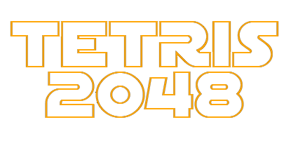

# Tetris 2048 (Tetris2048-Game)

A hybrid puzzle game that blends **Tetris**-style falling tetrominoes with **2048**-style number merging.

Built with **Python 3.10**, **Pygame**, and a small drawing utility (`lib/stddraw.py`).

---

## Highlights

- Tetris movement, rotation, and **hard drop**
- 2048 merge mechanic (**equal tiles combine and double**)
- Scoring based on merges and cleared lines
- **Next piece** preview panel
- Pause screen + restart
- Win condition when reaching a **2048** tile

---

## Controls

| Key | Action |
|---|---|
| Left / Right | Move tetromino |
| Down | Soft drop |
| Up | Rotate |
| Space | Hard drop |
| P | Pause / resume |
| R | Restart (while paused) |

---

## Screenshots

### Main Menu



### Pause Screen


---

## Quickstart

### 1) Clone

```bash
git clone https://github.com/alirkal34-jpg/Tetris2048-Game.git
cd Tetris2048-Game
```

### 2) Create a virtual environment (recommended)

```bash
python -m venv .venv
# Windows
.venv\Scripts\activate
# macOS/Linux
source .venv/bin/activate
```

### 3) Install dependencies

```bash
pip install -r requirements.txt
```

### 4) Run

```bash
python Tetris_2048.py
```

---

## Tech Stack

- **Python 3.10**
- **Pygame** (rendering + input)
- **NumPy** (matrix operations)

---

## Project Structure

```
Tetris2048-Game/
├── Tetris_2048.py          # Main loop + UI screens (menu/pause/end)
├── game_grid.py            # Grid state, merges, scoring, line clearing
├── tetromino.py            # Tetromino shapes, movement, rotation
├── tile.py                 # Tile values + rendering
├── point.py                # Point helper
├── lib/                    # Drawing & graphics helpers
│   ├── stddraw.py
│   ├── picture.py
│   └── color.py
└── images/                 # Menu/pause images used by the UI
```

---

## Notes on Implementation

- The game grid is stored as a matrix (`tile_matrix`) and updated when a tetromino locks.
- After locking, the grid processes merges and applies gravity-like dropping.
- Clearing full lines and removing disconnected (“floating”) tiles contributes to score.

---

## License

MIT License. See `LICENSE` for details.

---

## Author

Developed by **alirkal34-jpg**.

If you’d like to suggest improvements, feel free to open an issue or a pull request.
